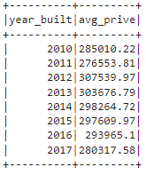

# Home_Sales

Overview

In this Challenge, Google Colaboratory and SparkSQL was used to determine key metrics about home sales data. Using SparkSQL involved various operations such as creating temporary views, partitioning the data, caching and uncaching a temporary table, and verifying that the table has been uncached.

Summary

Query 1: Average price for a 4-bedroom house sold for each year

Query 2: Average price fo a home for each year it was built that has 3-bedrooms and 3-bathrooms

Query 3: Average price of a home for each year that has 3-bedrooms, 3-bathrooms, 2 floors, and is greater than or equal to 2,000 sqft

Query 4: View rating for homes that cost great han or equal to $350,000

Also, I compared the run times for Query 4 based on Uncache, Cached, and Runtime with the parquet DataFrame

Uncached: 1.09 secs
Cached: 0.68 secs
Parquet DataFrame: 0.57

